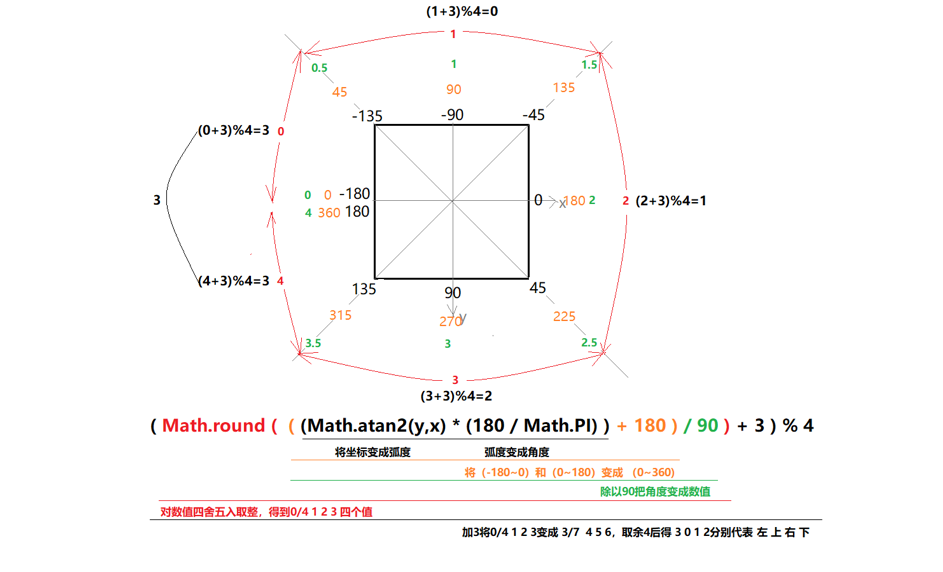

## animation动画

**animation** 

​	**animation 属性是一个简写属性，用于设置动画属性。** 

​	**animation-name  规定需要绑定到选择器的 keyframe 名称。** 

​	**animation-duration  规定完成动画所花费的时间，以秒或毫秒计。** 

​	**animation-timing-function   规定动画的速度曲线。** 

​	**animation-delay 规定在动画开始之前的延迟。** 

​	**animation-iteration-count   规定动画应该播放的次数。** 

​		*n 播放n次*

​		*infinite 无限次*

​	**animation-direction 规定是否应该轮流反向播放动画。** 

​		*normal 默认值，按照顺序正常播放* 

​		*reverse 动画反向播放* 

​		*alternate 动画在奇数次正向，偶数次反向播放* 

​		*alternate-reverse 动画在奇数次反向，偶数次正向播放* 

​	**animation-fill-mode 属性规定动画在播放之前或之后，其动画效果是否可见。** 

​		*none    不改变默认行为。*

​		*forwards    当动画完成后，保持最后一个属性值（在最后一个关键帧中定义）。*

​		*backwards   在 animation-delay 所指定的一段时间内，在动画显示之前，应用开始属性值（在第一个关*

​		*键帧中定义）。*

​		*both    向前和向后填充模式都被应用。*

​	**animation-play-state 属性规定动画正在运行还是暂停。** 

​		*paused  规定动画已暂停。* 

​		*running 规定动画正在播放。* 

```css
.demo{
    position: absolute;
    top: 100px;
    left: 100px;
    width: 100px;
    height: 100px;
    background: pink;
    font-size: 20px;
    color: white;
    border-radius: 50%;
    text-align: center;
    line-height: 100px;
    animation: move 2s linear;
}
@keyframes move{
    0%{
        left: 100px;
    }
    100%{
        left: 600px;
    }
}
```

​	关键帧 为百分比，如果只从0%到100%可以用关键字form，to；

​	filter: blur(10px); 模糊


**项目：感知鼠标滑过方向图片遮罩效果** 



