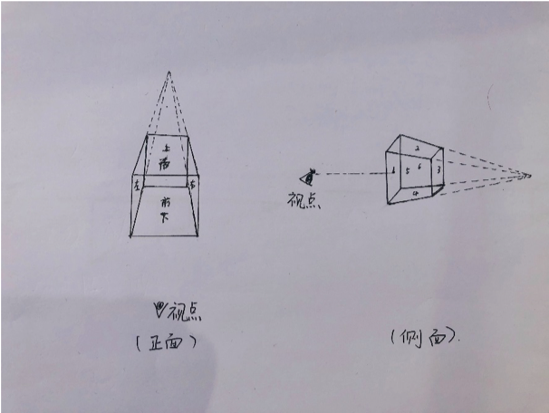
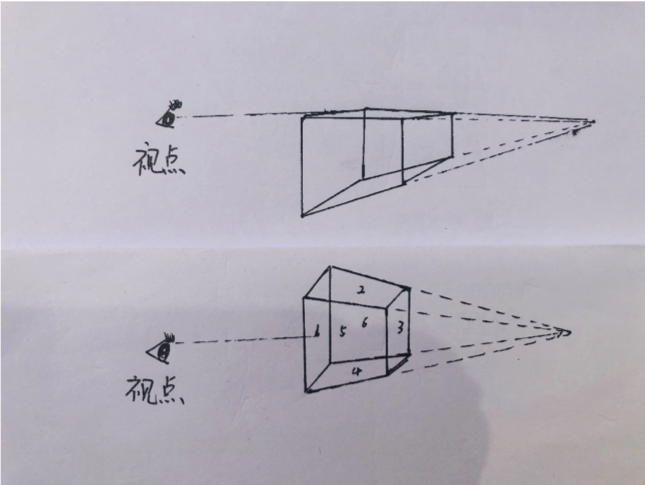

## CSS3D

#### 开启3D

```css
parent{
  perspective: 800px;
  transform-style: preserve-3d;
}
```

定义 3D 元素距视图的距离，以像素计。当为元素定义 `perspective `属性时，其子元素会获得透视效果，而不是元素本身。

`perspective`：距离屏幕的距离(px)

在父级设置   `transform-style: preserve-3d;`  保留3D效果；



##### `perspective-origin`视点得位置   perspective-origin: x y;默认50% 50%;




##### `translate3d(x,y,z,n)` 


##### `transform-style`指定嵌套元素是怎样在三维空间中呈现。

`transform-style: flat|preserve-3d;`

注：设置了`transfrom-style:preserve-3d`的元素，不能防止子元素溢出，即不能设置`overflow:hidden;`否则persever-3d失效；


##### `backface-visibility `属性定义当元素背面是否可见。

`backface-visibility: visible | hidden;`


**动画优化** 

1、减少试用left width margin做动画，用transform替换

2、利用3d变形来开启GPU加速，使动画更流畅

3、动画过程有闪烁（一般出现在动画开始）

```css
-webkit-backface-visibility:hidden;
-moz-backface-visibility:hidden; 
-ms-backface-visibility:hidden; 
backface-visibility:hidden; 
-webkit-perspective:1000; 
-moz-perspective:1000; 
-ms-perspective:1000; 
perspective:1000;
```


#### CSS3D库

[css 3d engine](http://css3d.bitworking.de/)


#### H5设备API

1. `deviceorientation` 设备物理方向信息，表示一系列本地坐标系的旋角。

   ```javascript
   if (window.DeviceOrientationEvent) {
       window.addEventListener("deviceorientation", function(event) {
           // alpha: rotation around z-axis
           var rotateDegrees = event.alpha;
           // gamma: left to right
           var leftToRight = event.gamma;
           // beta: front back motion
           var frontToBack = event.beta;
   
           handleOrientationEvent(frontToBack, leftToRight, rotateDegrees);
       }, true);
   }
   
   var handleOrientationEvent = function(frontToBack, leftToRight, rotateDegrees) {
       // do something amazing
   };
   ```

   

   alpha：设备沿z轴方向的选转，水平面上的选择，范围：-360~360

   beta：设备沿x轴方向的旋转，由前向后，范围：-180~180

   gamma：设备沿y轴方向的旋转，由左向右，范围：-90~90

   

2. `devicemotion ` 提供设备的加速度信息

3. `compassneedscalibration` 用于通知web站点使用罗盘信息校准上述事件

