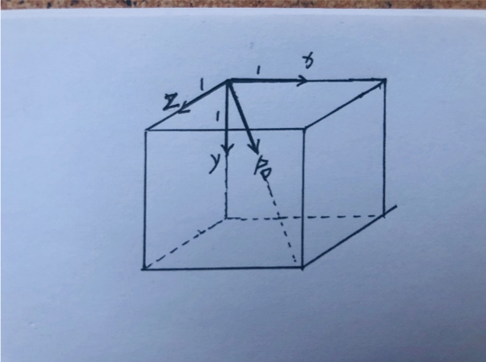

## CSS3 3D变换动画


**perspective** (将该元素设置到父级)

定义 3D 元素距视图的距离，以像素计。当为元素定义 perspective 属性时，其子元素会获得透视效果，而不是元素本身。

​	perspective：距离屏幕的距离（ px ）；


在父级设置   transform-style: preserve-3d;  保留3D效果；


**translate3d(x,y,z,n)** 



**perspective-origin视点得位置   perspective-origin: x y;默认50% 50%;** 


**transform-style指定嵌套元素是怎样在三维空间中呈现。**

transform-style: flat|preserve-3d;

注：设置了transfrom-style:preserve-3d的元素，不能防止子元素溢出，即不能设置overflow:hidden；否则persever-3d失效；


**backface-visibility 属性定义当元素背面是否可见。** 

backface-visibility: visible | hidden;


**动画优化** 

1、减少试用left width margin做动画，用transform替换

2、利用3d变形来开启GPU加速，使动画更流畅

3、动画过程有闪烁（一般出现在动画开始）

```css
	-webkit-backface-visibility:hidden;

	-moz-backface-visibility:hidden; 

	-ms-backface-visibility:hidden; 

	backface-visibility:hidden; 

	-webkit-perspective:1000; 

	-moz-perspective:1000; 

	-ms-perspective:1000; 

	perspective:1000;
```


