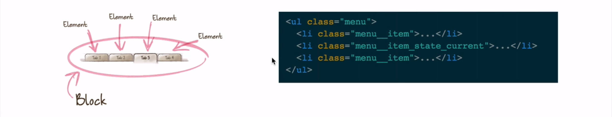
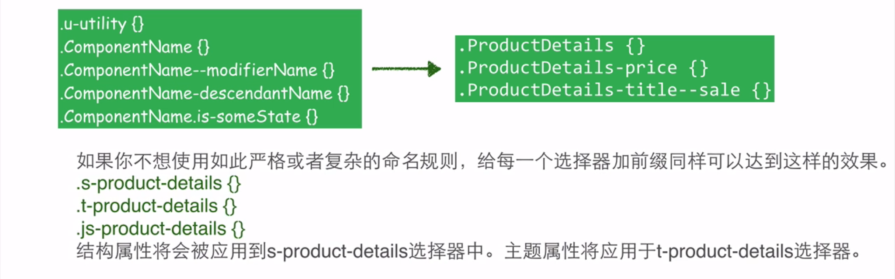
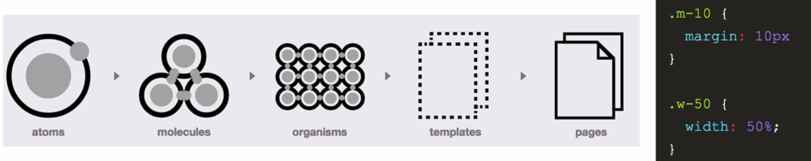
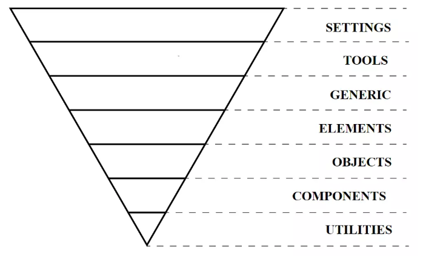

## CSS分层

#### 为什么要分层

##### 原因

- CSS有语义化的命名约定和CSS层的分离，将有助于它的可扩展性，性能的提高和代码的组织管理。
- 大量的样式，覆盖、权重和很多的 `!important`，分层可以让团队命名统一规范，方便维护。
- 有责任感的去命名你的选择器。

#### SMACSS

SMACSS（Scalable and Modular Architecture for CSS）可扩展的模块化架构的CSS，像OOCSS一样以减少重复样式为基础。然而SMACSS使用一套五个层次来划分CSS给项目带来更结构化的方法

这一点是SMACSS的核心。SMACSS认为css有5个类别，分别是：

##### 1、Base（基础）

基础的样式，就是一些需要最先定义好，针对于某一类元素的通用固定样式。

##### 2、Layout（布局）

布局样式，是跟页面整体结构相关，譬如，列表，主内容，侧边栏的位置、宽高、布局方式等。

##### 3、Module（模块）

模块样式，就是我们在对页面进行拆的过程中，所抽取分类的模块，这类的样式分别写到一起。

##### 4、State（状态）

页面中的某些元素会需要响应不同的状态，比如，可用、不可用、已用、过期、警告等等。将这类样式可以组织到一起。

##### 5、Theme（主题）

主题是指版面整个的颜色、风格之类，一般网站不会有频繁的较大的改动，给我们印象比较深的是QQ空间，其他应用的不是很多，所以，这个一般不会用到，但有这样一个意识是好的，需要用到的时候，就知道该怎样规划

#### BEM

BEM和SMACSS非常类似，主要用来如何给项目命名。一个简单命名更容易让别人一起工作。比如选项卡的导航是一个块(Block)，这个块里的元素是其中标签之一(Element)，而当前选项卡是一个修饰符状态(Modifier)

- block-代表更高级别的抽象或组件
- block__element-代表block的后代，用于形成一个完整的.block的整体。
- .block--modifier-代表.block的不同状态或不同版本

> 修饰符使用的是`_`，子模块使用`__`符号。(不同一个-的原因是单词的链接)

#### SUIT

suit起源于BEM，但是它对组件名使用驼峰式和连字符把组件从他们的修饰符和子孙后代中区分出来

> 修饰符使用的是`_`，子模块使用`__`符号。(不同一个-的原因是单词的链接)

#### ACSS

考虑如何设计一个系统的接口。原子(Atoms)是创建一个区块最基本的特征，比如说表单按钮。分子(Molecules)是很多原子的(Atoms) 的组合，比如说一个表单中包括一个标签，输入框和按钮。生物(Organisms)是众多分子(Molecules)的组合物比如一个网站的顶部区域，他包含了网站的标题、导航等。而模板(Templates)又是众多生物(Organisms)的组合体。比如一个网站页面的布局，而最后的页面就是特殊的模板。

#### ITCSS

ITCSS代表  *Inverted Triangle CSS*  ，它可以帮助您组织项目CSS文件，从而可以更好地  **处理**  （并非总是易于处理）CSS细节，例如  **全局命名空间，级联和选择器特异性**。

这些层如下：

**设置**  –与预处理器一起使用，并包含字体，颜色定义等。

**工具**  –全局使用的mixin和功能。重要的是不要在前2层中输出任何CSS。

**通用**  –重置和/或规范化样式，框大小定义等。这是生成实际CSS的第一层。

**元素**  –HTML元素（例如H1，A等）的样式。这些带有浏览器的默认样式，因此我们可以在此处重新定义它们。

**对象**  –定义未装饰设计模式的基于类的选择器，例如OOCSS已知的媒体对象

**组件**  –特定的UI组件。这是我们大部分工作的地方，我们的UI组件通常由对象和组件组成

**实用程序**  –实用程序和帮助程序类能够覆盖三角形中之前发生的任何事情

### 参考

https://www.leemunroe.com/css-sass-scss-bem-less/

