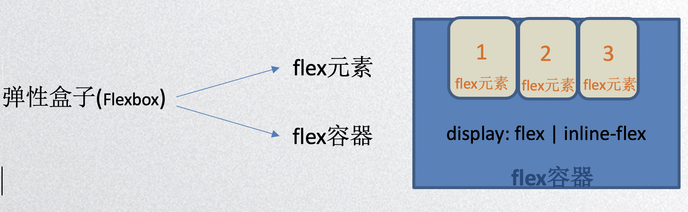
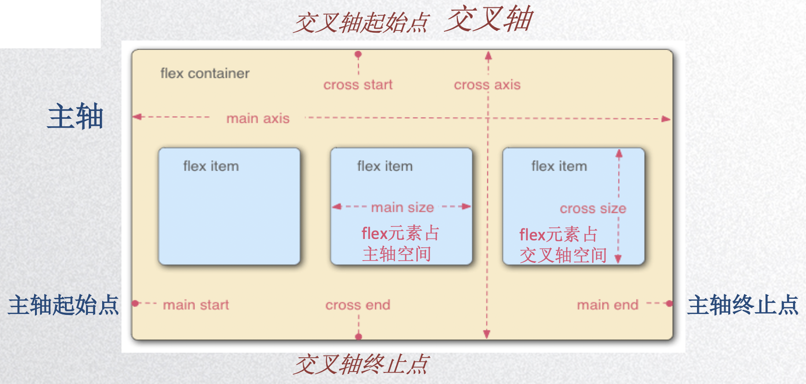

## Flex弹性盒子

**定义弹性盒子** 

​	flexbox，是一种*一维*的布局模型。它给flexbox的子元素之间提供了强大的空间分布和对齐能力。

​       注意：columns属性再伸缩容器上没效果，同时float,clear和vertical-align属性再伸缩项目上页没有效果

1. 将父级设置display: flex;时，子元素相当于行级块元素 
2. 子元素会按照轴排序 ，不会在意换行符的空隙
3. 默认情况下不会超出， 超出的部分按比例压缩

**flexbox的两根轴线** 

主轴和交叉轴：交叉轴永远垂直于主轴

方向：主轴方向可以 水平从左向右，水平从右向左，垂直从上到下，垂直从上到下；

起始位置和终止位置：子元素对齐方式 从起始位置开始对齐， 从终点位置开始对齐 ，中间对齐，分散开对齐

**初始效果**  

所有CSS属性都会有一个初始值，所以 flex 容器中的所有 flex 元素都会初始默认效果：

1. 主轴水平从左向右。元素排列为一行 (`flex-direction` 属性的初始值是 `row`)。
2. 元素从左边起始线开始(`justify-content:flex-start`)。元素从主轴的起始线开始。
3. 默认不拉伸(`flex-grow:0`)，但是会压缩(`flex-shrink:1`)不换行(`flew-wrap:nowrap`)。元素不会在主维度方向拉伸，但是可以缩小。
4. 不设置高度时flex元素充满flex容器(`align-items:stretch`)。元素被拉伸来填充交叉轴大小。

**flex容器属性** 

1、`flex-direction:`设置flex容器主轴的方向

​		`row ` (默认)默认方向

​		`row-reverse `默认方向 首尾互换

​	    `column `垂直 从上到下

​		`column-reverse` 垂直 从下到上

2、`flex-wrap: ` 控制flex容器是单线还是多线，以及新线的堆叠方向	

​		`nowrap ` 单行

​		`wrap ` 多行

​		`wrap-reverse `  新的一行排在原来一行的上面

3、`flex-flow: ` `flex-direction` ` flex-wrap;`  复合写法

4、`justify-content：` 项目在主轴上的对齐方式

​		`flex-start` (默认) 从主轴的起始点开始排列

​		`flex-end  ` 从主轴的终止点开始排列

​		`center  ` 居中

​		`space-between  `两端对齐，每两个flex元素之间的空隙相等 (起始点与终止点没有空隙)

​		`space-around   ` 两端对齐，每个项目两侧的距离相等

5、`align-items:` 单行项目在交叉轴上的对齐方式

​		`flex-start  ` (默认)与交叉轴起始点齐平

​		`flex-end `与交叉轴终止点齐平

​		`center  `居中对齐

​		`baseline`  flex元素的第一行文字为基准对齐

​		`stretch`   flex元素未设置高度时，高度充满flex容器高度 (当flex项目不设置高度的时候 默认为stretch)

6、`align-content: `多线的对齐方式，单线不起作用

​		`flex-start ` 打包 与交叉轴起始点齐平

​		`flex-end ` 打包 与交叉轴终止点齐平

​		`center`   打包居中

​		`stretch`  未设置高/宽度时占满整个交叉轴

​		`space-between `  交叉轴两端对齐   (起始点与终止点没有空隙)

​		`space-around`   每跟轴两侧空隙相等

**flex元素属性**

1、`flex-basis: length; ` （px   默认由width / height 来决定）定义该元素在主轴上的尺寸  main-size 

​	主轴在水平方向的时候由宽度决定  主轴在垂直方向的时候由高度决定

2、`flex-grow: number;` 拉伸比例，默认值为0

3、`flex-shrink: number;` 压缩比例，默认值为1

4、`flex: ` `flex-grow` ,` flex-shrink`, ` flex-basis`，默认值 0 1 auto

5、`align-self: `单个项目在cross轴上的对齐方式

​		`flex-start ` cross-start齐平

​		`flex-end`  cross-end齐平

​		`center ` 居中

​		`baseline  `第一行文字

​		`stretch ` 未设置高度时 该元素高度为flex容器高度 

6、`order：number `该项目排列的位置 (值从小到大排列) 

