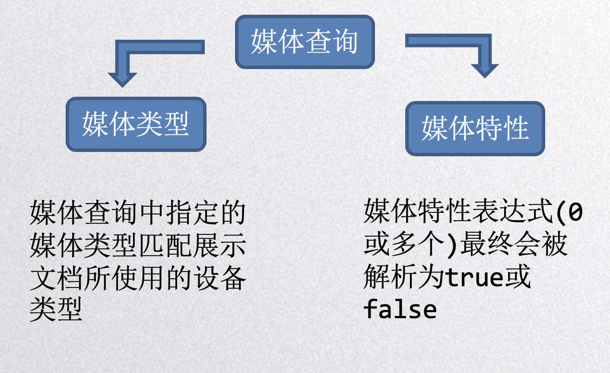

## Media媒体查询

**常见页面布局**

​	静态布局

​	流式布局

​	自适应布局

​	响应式布局


**媒体查询的使用** 




**媒体查询的使用** 

*link元素中的css媒体查询*

```css
<link rel="stylesheet" href="demo.css" media="screen and (max-width: 800px)">
```

​	最大宽度为800的时候生效


*样式表中的css媒体查询*

```css
@media screen and (max-width: 600px) {
   .demo{
        background: pink;
        color: deeppink;
   }
}
```


**媒体类型** 

| 类型       | 解释                                   |
| ---------- | -------------------------------------- |
| all        | 所有设备                               |
| braille    | 盲文                                   |
| embossed   | 盲文打印                               |
| handheld   | 手持设备                               |
| print      | 文档打印或打印预览模式                 |
| projection | 项目演示，比如幻灯                     |
| screen     | 彩色屏幕                               |
| speech     | 演讲                                   |
| tty        | 固定字母间距的网格媒体，比如电传打字机 |
| tv         | 电视                                   |


**媒体特性** 

| 属性                | 值                      | Min/Max | 描述                     |
| ------------------- | ----------------------- | ------- | ------------------------ |
| color               | 整数                    | yes     | 每种色彩的字节数         |
| color-index         | 整数                    | yes     | 色彩表中的色彩数         |
| device-aspect-ratio | 整数/整数               | yes     | 宽高比                   |
| device-height       | length                  | yes     | 设备屏幕的输出高度       |
| device-width        | length                  | yes     | 设备屏幕的输出宽度       |
| grid                | 整数                    | no      | 是否是基于格栅的设备     |
| height              | length                  | yes     | 渲染界面的高度           |
| monochrome          | 整数                    | yes     | 单色帧缓冲器中没像素字节 |
| resolution          | 分辨率(" dpi / dpcm ")  | yes     | 分辨率                   |
| scan                | Progressive  interlaced | no      | tv媒体类型的扫描方式     |
| width               | length                  | yes     | 渲染界面的宽度           |
| orientation         | Portrait / landscape    | no      | 横屏或竖屏               |

***媒体查询的逻辑操作符***  

**and操作符 ** 

`and`关键字用于合并多个媒体属性或合并媒体属性与媒体类型。

`@media screen and (min-width: 500px) and (max-width: 800px) `


**逗号分隔列表** 
`,`  媒体查询中使用逗号分隔效果等同于or逻辑操作符。当使用逗号分隔的媒体查询时，如果任何一个媒体查询返回真，样式就是有效的。

`@media (max-width: 300px), screen and (orientation: landscape)`


**not操作符** 

`not` 关键字应用于整个媒体查询，在媒体查询为假时返回真

`@media not screen and (min-width: 500px) and (max-width: 800px)`


**only操作符 ** 

`only`关键字防止老旧的浏览器不支持带媒体属性的查询而应用到给定的样式

` @media only screen and (min-width: 500px) and (max-width: 800px)` 

