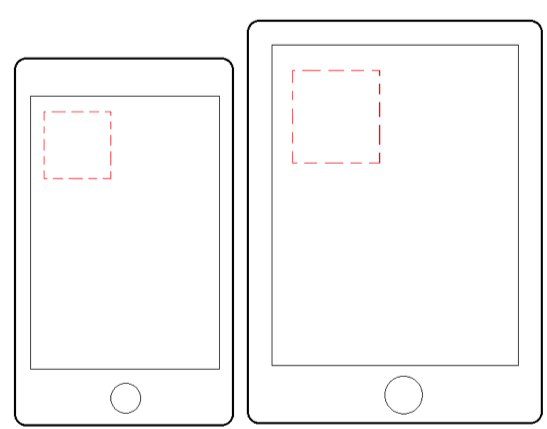
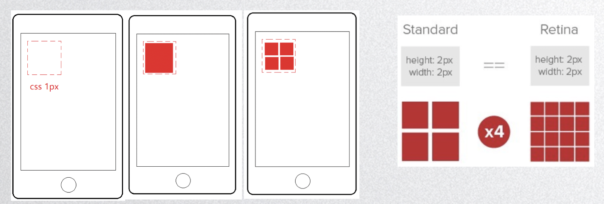
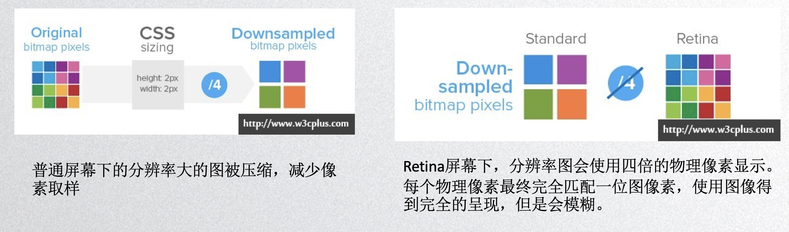

## 移动端布局

**等比缩放** 

​	**百分比布局** 

​	**flex布局** 

​	**单位`rem`**     1rem的大小由html的font-size的像素值决定 

​			**`em`**       1em的大小由父级的font-size的像素值决定 

​		通过js动态获取屏幕宽度来设置html的font-size

```javascript
function newWidth(){
  var w = document.documentElement.clientWidth;
  var a = document.documentElement.style.fontSize = w/10 + 'px';
  console.log(a);
}    
newWidth();    
window.onresize = function(){ //当窗口大小改变的时候重新设置fontSize的大小 
  newWidth();
}
```

​	**单位`vw` `vh`**   它会把屏幕分成100份 ，1份就是1vw/vh  ( 1vw/vh  相当于屏幕宽高的 1%)  




***viewport***  

**物理像素：**物理像素又被称为设备像素，他是显示设备中一个最小的物理部件。每个像素可以根据操作系统设置自己的颜色和亮度。

**逻辑像素：**一个可以由程序使用的虚拟像素(比如说CSS像素)，然后由相关系统转换为物理像素。

**设备像素比(dpr) = 物理像素/逻辑像素**  




**Viewport视窗** 

viewport是严格等于浏览器的窗口。在桌面浏览器中，viewport就是浏览器窗口的宽度高度。但在移动端设备上默认为980px。

viewport就是浏览器上，用来显示网页的那一部分的区域。Ios及新版本浏览器默认viewport为980px。

```html
    <meta name="viewport" content="width=device-width, initial-scale=1.0">
																			宽度等于屏幕宽度。              缩放 
																												dpr = 2 为0.5
																												dpr = 3 为0.3333...
```


**viewport默认有6个属性：** 

| 属性          | 解释                                                     |
| ------------- | -------------------------------------------------------- |
| width         | 设置viewport宽度，可以为一个整数，或字符串"device-width" |
| initial-scale | 页面初始的缩放值，为数字，可以是小数                     |
| minimum-scale | 允许用户的最小缩放值，为数字，可以是小数                 |
| maximum-scale | 允许用户的最大缩放值，为数字，可以是小数                 |
| height        | 设置viewport的高度（我们一般而言并不能用到）             |
| user-scalable | 是否允许用户进行缩放，'no'为不允许，'yes’为允许          |


通过javascript动态获取dpr 生成meta标签

```javascript
var oMeta = document.createElement('meta');
oMeta.setAttribute('name','viewport');
if(window.devicePixelRatio >= 2){
    oMeta.setAttribute('content', 'width=device-width, initial-scale=0.5, minimum-scale=0.5, maximum-scale=0.5, user-scalable=no');
}
if(window.devicePixelRatio >= 3){
    oMeta.setAttribute('content', 'width=device-width, initial-scale=0.3, minimum-scale=0.3, maximum-scale=0.3, user-scalable=no');
}
document.getElementsByTagName('head')[0].appendChild(oMeta);
```


根据dpr的值来修改viewport实现1px的线

解决方案：

1、动态生成mate标签

```html
<meta name="viewport" content="width=device-width, initial-scale=0.5, maximum-scale=0.5, minimum-scale=0.5, user-scalable=no">
```

2、css3 transform:scale缩放

```css
@media
only screen and (-webkit-min-device-pixel-ratio: 2),
only screen and ( min--moz-device-pixel-ratio: 2),
only screen and ( -o-min-device-pixel-ratio: 2/1),
only screen and ( min-device-pixel-ratio: 2),
only screen and ( min-resolution: 192dpi),
only screen and ( min-resolution: 2dppx){ 
     div{
             transform: scale(0.5, 0.5);
     }
}
```


**综合解决方案：**

**方案一：手淘解决方案 flexbile** 

<http://g.tbcdn.cn/mtb/lib-flexible/0.3.4/??flexible_css.js,flexible.js>

1、根据屏幕大小动态改变html的fontSize，达到等比缩放问题 

2、给body设置fontSize，字体大小可以直接继承body的font-size

3、给html标签添加data-dpr属性，可以通过查找该属性，给不同dpr元素设置个性化属性

[data-dpr='2'] div{

​     font-size:  26px;

}


**方案二： Vw+postcss(插件) （推荐）** 

根据设置稿（如宽度750px的设计稿），以px为单位写大小，转换成vw。解决等比缩放问题。

至于小于等于1px的线，以px为单位不专成vw。 postcss-write-svg插件主要用来处理移动端1px的解决方案。该插件主要使用的是border-image和background来做1px的相关处理，编译出来是border-image或者background


**dpr 不同的设备上图片的适配问题？** 




