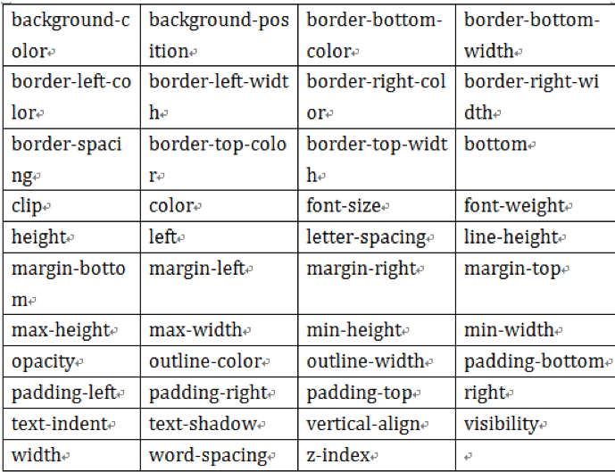

## transition过渡动画


**transition: property | duration | timing-function | delay;**

​	transition-property 规定设置过渡效果的 CSS 属性的名称。 ( 只能过度有值的属性 ) all是全部属性

​	transition-duration 规定完成过渡效果需要多少秒或毫秒。

​	transition-timing-function  规定速度效果的速度曲线。

​	transition-delay    定义过渡效果何时开始。


**transition-timing-function 规定设置过渡效果的 CSS 属性的名称。** 

​	transition-timing-function: linear | ease | ease-in | ease-out | ease-in-out 

​						cubic-bezier(n,n,n,n);


​	linear 匀速, cubic-bezier(0,0,1,1) 

​	ease 慢快慢， cubic-bezier(0.25,0.1,0.25,1) 

​	ease-in 慢速开始的过渡， cubic-bezier(0.42,0,1,1) 

​	ease-out 慢速结束的过渡， cubic-bezier(0,0,0.58,1) 

​	ease-in-out 慢速开始和结束的过渡， cubic-bezier(0.42,0,0.58,1) 

​	cubic-bezier(n,n,n,n) 在 cubic-bezier函数中定义自己的值。可能的值是 0 ~1 之间的数值。


**transition-property 规定设置过渡效果的CSS 属性的名称。** 



实现动画的方法：

```html
<!DOCTYPE html>
<html lang="en">
<head>
    <style>
        #demo{
            width: 100px;
            height: 100px;
            background-color: pink;
            transition: transform 4s linear,height 2s linear 2s;
        }
        #demo.move{
            transform :translateX(600px);
            height: 200px;
        }
    </style>
</head>
<body>
    <div id="demo"></div>
    <script>
        demo.onclick=function(){
            demo.className = "move";
        }
    </script>
</body>
</html>
```


