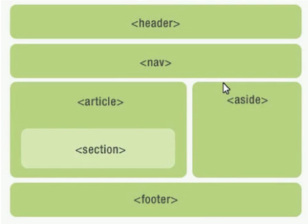
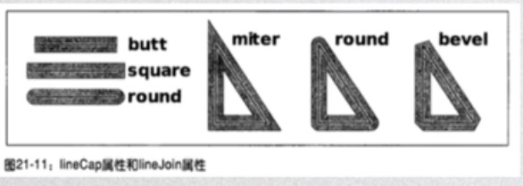
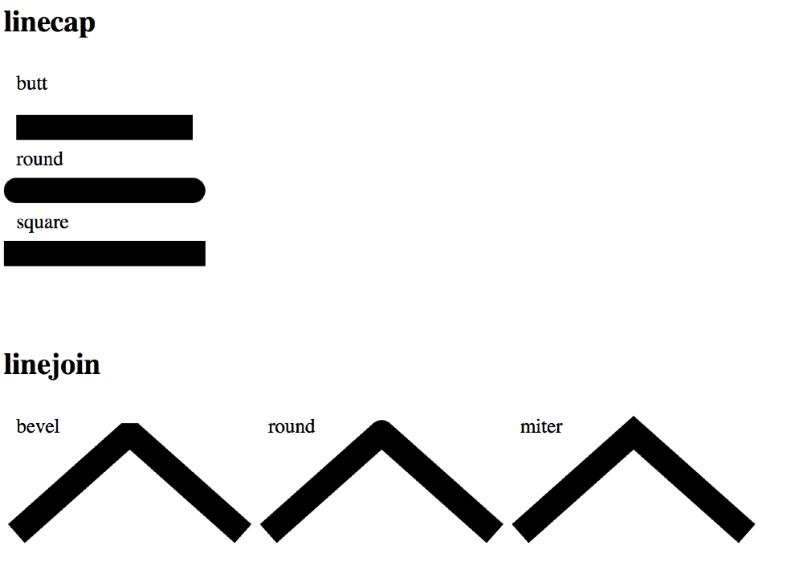
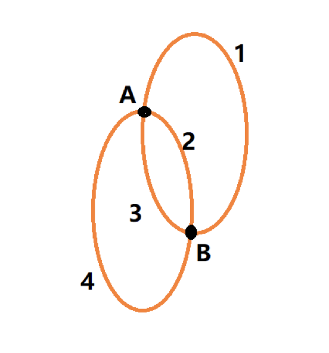
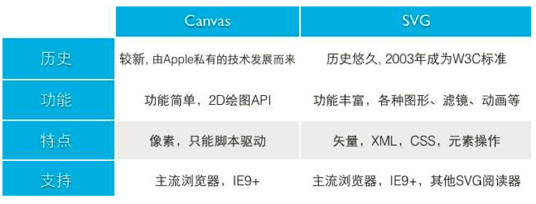
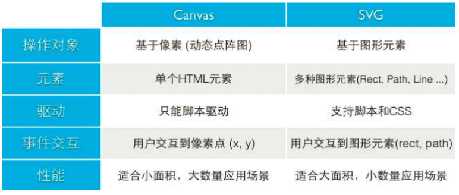

[TOC]


# HTML

## HTML常用标签

```html
<b></b>       粗体
<i></i>       斜体
<u></u>       下划线
<s></s>       删除线
<del></del>   删除线
<sup></sup>   上标
<sub></sub>   下标
<p></p>        段落
<br>           换行
<h1> ~ <h6>     标题权重大小标签
```

**列表：** 

1. 有序列表

```html
<ol type="a">
	<li>有序列表</li>	
    <li>有序列表</li>
</ol>
```

2. 无序列表

```html
<ul type="square"> <!--square列表开头为方块-->
	<li>无序列表</li>	
    <li>无序列表</li>
</ul>
```

3. 定义列表（一般用于解释）

```html
<dl>
	<dt>你什么事回家？</dt> 内容的标题
	<dd>晚上八点。</dd> 内容 
</dl>

```


```html
<pre></pre>  预定义文本标签 （保留空格和换行符）

&lt;body&gt;   对HTMl转义 

&nbsp;&nbsp;  为一个空格

<abbr title="Hyper text markup language">HTML</abbr> 
 缩写说明（对文字的内容进行解释）
```


**超链接标签 :** 

```html
<a href="http://www.baidu.com" target="blank">百度</a> 	target="blank" 在新窗口打开
```


**锚点标签：** 

```html
<a href="#">回到页面最顶上</a>   点击回到页面顶部
```

```html
<a href="#test">页面指定位置</a>    
<span id="test">				到达页面指定位置
```

**图片链接：**

```html
 
<!-- ../ 为上一级 ；  title="文字" 鼠标放在图片上有文字显示 -->     

```

**图片映射：（图片中多个可点击区域）**

```html
 <!--usemap="#test" 使用地图-->
<map name="test"> <!--地图-->
	<area shape="circle" coords="376,232,50" href="http://baidu.com" 			alt="" 			target="blank"><!--可点击区域-->
	<area shape="rect" coords="591,184,720,288" 	 
		href="http://mba.sjtu.edu.cn" alt="" target="blank">
<!--shape=""可点击区域形状  poly多边形 circle圆 rect矩形; coords=""坐标 -->
</map>

```

**表格：** 

```html
<caption>标题</caption>
<table border="1px" cellspacing="5px"> 
<!--border为边框 cellspacing 指单元格之间的距离-->
<tr></tr>    行标签
<th></th>    表头标签
<td></td>    数据列
colspan="2"  和并列
rowspan="2"  合并行
</table>
```


**媒体：** 

```html
<audio src="音频文件" controls="controls" loop="5"></audio>
	<!--音频标签
	controls="controls"控制器 
	autoplay="autoplay"自动播放
	loop="5"播放次数-->
<video src="视频文件"></video>    视频标签

```


## HTML5概述.新特性

​	HTML5 w3c规范在2008年提出

**HTML5理念**

​	1.避免不必要的复杂

​	2.支持已有的写法

​	3.解决实际问题

​	4.优雅降级  （当浏览器不支持新的写法时会优雅降级到默认的值上）

​	5.用户优先  （用户>开发者>浏览器开发厂商>标准制定者>理论上的完美 )

**Doctype**

​	指web浏览器关于页面使用哪个HTML版本进行编写指令。

​	html5简化如下：<!DOCTYPE html>；

**标准模式，怪异模式**

​	验证：

​		在js中打印（“document.comapatMode“）

​		BackCompat->表示怪异模式

​		Css1Compat ->表示标准模式

​	区别：

​		1.标准盒模型和ie6混杂盒模型：标准下盒子宽度=width+padding+border;  ie6之前才会触发ie6混合

​		2.table字体在标准模式下继承body，怪异模式下不继承body

​		3.ie6以下版本中可以给span等行元素设置宽高

​		4.即使父级没有高度，也可以设置百分比高度

​		5.ie6以下 margin：0 auto 不能左右居中

​		6.ie6以下的图片padding失效


ie6混杂模式盒模型 把padding border都缩在width里面了，导致content区域变小 


**HTML5新特性** 

​	1.主要的新特性

​	2.新语义元素

​	3.forms 2表单元素 HTML网页表单的改进，其中为 input 标签引入了新属性。

​	4.音视频

​	5.画布

​	6.拖放

​	7.文件读取

​	8.回调函数管理api

​	9.地理位置

​	10.执行脚本多线程worker

​	11.本地储存

​	12.websocket

​	13.HistoryAPI

​	14.跨文档通信postmessage


​															                        


## 常用元素：HTML5结构元素

**html5结构元素**

1. header 整个页面的头部，某块区域的标题 页眉。
2. footer 文档或某一块的底部 页脚。
3. main 主要内容区域。
4. nav 导航链接部分。
5. section 页面中一个内容区域。
6. article 它代表一个独立的完整的相关内容块。
7. aside 元素表示一个页面的一部分，它的内容跟这个页面的其他内容的关联性不强，或者没有关联，单独存在。
8. figure 标签规定独立的流内容（图像 图表 照片 代码等等）。



​                                     

**Iframe:嵌套页面** 

```html
<iframe src="http://www.baidu.com" frameborder="0"></iframe> 
<!--嵌套页面 -->

 frameset：与body平级，有frameset没body
<frameset rows="20%,80%">
	<frame src="123.html">
	<frame src="456.html">
</frameset>
```


块元素：独立成一行 可以设置宽高 默认宽高100%

文字块元素： p    h1~h6

容器类块元素： div   table   tr   td   th  form  ul li  ol  li  dl dt dd

 

行元素：不独立成一行 不可以设置宽高 内容决定

a  img  input  strong  em  del  span 

 

特殊字符：文字 br     & nbsp;

 

嵌套规则

1. 块元素可以嵌套行元素
2. 行元素可以嵌套行元素
3. 行元素不可以嵌套块元素
4. 文字类块元素不可以嵌套块元素
5. 容器类块元素可以嵌套块元素

​                                                                                                                 


## 常用元素：HTML5功能元素

**video 视频** 

**audio 音频** 

**source 资源** 

**figcaption 标签定义 figure 元素的标题 ** 

**canvas 画布 ** 

**progress 进程**  （进度条） 

```html
<!DOCTYPE html>
<html lang="zh">
<head>
    <meta charset="UTF-8">
    <title>Page Title</title>
    <style>
        span{
            display: none;
        }
    </style>
</head>
<body>
    <progress id="pro" max="100" min="0" value="0"></progress>
    <span id="ok">完成</span>
    <script>
        var tinmer = setInterval(function(){
            if(pro.value == 100){
                clearInterval(tinmer);
                ok.style.display = "block";
                return; //清除后不继续执行
            }
            pro.value +=10;
        },100) 
    </script>
</body>
</html>
```

​                                                                                                                                                           ----2018.9.17


## 常见元素：HTML5表单元素

**表单元素**

```html
    <form action="xxxx.aspx" method="get">
		action="xxxx.aspx"   表单里的元素提交页面
		method="get"  传值方式
		get  传比较小的数据
		post  数据较多的安全系数较高的
	<input type="text"> 文本输入框
    <input type="radio"> 小圆点 （当name值相同时只能单选）
	<input type="checkbox"> 一般用于复选框
    <input type="submit"> 提交按钮
    <input type="password"> 密码框
    <input type="button"> 普通的按钮
    <input type="file"> 上传文件  属性：multiple上传多个文件
	<input type="tel"> 电话输入框
    <input type="range" max="100" min="0" step="2"> 进度条
				属性：min 最小数字  max 最大数字  step 变换步长
    <input type="number"> 数字
    <input type="email"> 电子邮箱
    <input type="date"> 年月日
    <input type="month"> 年月
    <input type="week"> 年周
    <input type="time"> 时间
    <input type="datetime-local"> 表示本地时间和日期
    <input type="color"> 调出颜色面板
    <textarea name="text" cols="50" rows="20"></textarea>
			多行输入框   cols宽度 rows高度
	<input type="text" autofocus="autofocus"> autofocus="autofocus" 自动获取焦点（光标）
	<input type="reset">	 重置
	<input type="submit">	提交
```

**属性：**

​	placeholder 提示  （在输入框中提示该输入的内容）

```html
        <input type="tel" placeholder="请输入电话号码">
```

​	pattern 验证input 类型输入框中内容是否与正则匹配

```html
        <input id="test" type="text" pattern="^\d{6}$">

```

​	文本框下拉菜单

```html
<form autocomplete="on"> <!-- autocomplete="on" 自动筛选-->
    <input type="text" list="taglist">
<datalist id="taglist">
    <option>test</option>
</datalist> 
</form>

```

​	在表单标签外提交

```html
<form action="index.aspx" method="post" id="form1"> <!--在表单标签外提交-->
<input type="text" name="username">
<input type="text" name="pwd" formaction="index1.aspx"> 
<!--formaction="index1.aspx" 将文本框内数据单独提交到新页面--> 
<input type="submit"> 
</form>
<input type="password" form="form1">


```


## Audio/Video元素基本属性


**通过标签引入Audio/Video：controls为控件**

```html
    <audio src="./9420.mp3" controls></audio>
    <video src="./01.mp4" controls poster="./188.jpg"></video>

```

**通过JavaScript引入Audio/Video：**

```javascript
    var myAudio = new Audio("./9420.mp3");
    myAudio.controls = true;
    document.body.appendChild(myAudio);

```


|     属性     |       属性名       |
| :----------: | :----------------: |
|   视频海报   |       poster       |
|     控件     |      controls      |
|   自动播放   |      autoplay      |
|   循环播放   |        loop        |
|   视频静音   |       muted        |
|  全部预加载  |   preload="auto"   |
|  部分预加载  | preload="metadata" |
| 不进行预加载 |   preload="none"   |

**方法：**

**play() **播放

**pause() **停止

**loud() **重置媒体元素并重新载入媒体，可终止正在进行的任务或事件


**浏览器支持情况**

canPlayType()方法：

audio.canPlayType()  返回probably 或 maybe ，返回空为不支持

```html
<!DOCTYPE html>
<html lang="zh">
<head>
    <meta charset="UTF-8">
    <title>Page Title</title>
</head>
<body>
    <audio id="myAuido" src="./9420.mp3" controls></audio>
    <script>
        var myAuido = document.getElementById('myAudio');
        if(myAuido.canPlayType){
            if(myAuido.canPlayType('audio/mpeg') != ""){
                document.write('您的浏览器不支持mp3编码;');
            }
            if(myAuido.canPlayType('audio/ogg; codec="vorbis"') != ""){
                document.write('您的浏览器不支持ogg编码;');
            }
            if(myAuido.canPlayType('audio/mp4; codecs="mp4a.40.5"') != ""){
                document.write('您的浏览器不支持acc编码;');
            }    
        }else {
            document.write('您的浏览器不支持检测音频文件');
        }
    </script>
</body>
</html>

```


**currentSrc:**返回资源链接（注意要资源加载完才能获取到）

```javascript
var myAudio = document.getElementById('myAudio');
        myAudio.oncanplay = function(){
            console.log(myAudio.currentSrc);
        }

```


**duration：**媒体持续时间（总时长，注意要资源加载完才能获取到）

可由在该事件下获取 : audio.oncanplay = function() {}

**currentTime : **返回或设置资源当前时间

**volume : **音量 [0-1] ，可读可写

**muted : **静音 

​	实例：调整音频音量大小

```html
<body>
    <audio id="myAudio" src="./9420.mp3" controls></audio>
    <button id="current">currentTime</button>
    <button id="lessVolume">-</button>
    <button id="addVolume">+</button>
    <script>
        var myAudio = document.getElementById('myAudio');
        current.onclick = function(){
            console.log(myAudio.currentTime);
        }
        console.log(myAudio.volume);
        lessVolume.onclick = function(){
            var volume = parseInt((myAudio.volume - 0.1)*10)/10;
            if(volume >= 0 && volume <= 1 ){
                myAudio.volume = volume;
            }
            console.log(myAudio.volume);
        }
        
    </script>
</body>

```


**playbackRate:**读取或设置媒体资源播放的当前速率（大于1快放，小于1大于0慢放，无倒放）

```javascript
var myAudio = document.getElementById('myAudio');
id名.onclick = function(){
   myAudio.playbackRate +=0.1;
}
id名.onclick = function(){
   myAudio.playbackRate -=0.1;
}

```

**paused/ended/seeking:**查询媒体播放状态，返回 true/false

​	**paused：**是否暂停

```javascript
按钮id.onclick = function(){
    if(myAudio.paused){
    	myAudio.play();
    }
    else{
       myAudio.pause();
   }
}
```

​	**ended：**是否结束了

​	**seeking：**正在请求某一个位置的媒体数据

**played/buffered/seekable: **均返回一个TimeRanges对象

​	（timeRanges对象的length属性为部分时间段，end(i)返回已播放时间段的结束时间，start(i) 返回已播放时		间段的开始时间）

​	**played：**标明媒体资源在浏览器中已播放的时间范围。

​	**buffered：**确定浏览器已经缓存媒体文件。

​	**seekable：**表明可以对当前媒体资源进行请求。

**事件：**

**play：**媒体开始播放时触发

**pause：**媒体暂停时触发

**ended：**资源播放结束

**canplay：**浏览器能够开始播放媒体数据，但是不确定已当前的速率能否顺利地播放完媒体。


## canvas画布

**应用场景**

1.游戏场景

2.大量数据图表

3.动画

[Demo网站](http://codepen.io)

**发展历史及支持情况**

1.Canvas标记由Apple在Safari1.3 Web浏览器中引入

2.目前主流浏览器都支持，ie9之前的不支持

3.html5

**使用**

html：

```html
    <canvas id="myCanvas" width="400" height="400"></canvas>

```

​	width和height只是单位，不是像素（是将它的宽高平均分成400份）

js：

```javascript
var myCanvas = document.getElementById('myCanvas');   相当于画布
var ctx = myCanvas.getContext('2d');   相当于画笔

```

**绘制图形**

**1.直线**

​	moveTo(x,y)画笔挪到(x,y)点

​	lineTo(x,y)画笔划线到(x,y)点

样式：

​	stroke()描边画

​	lineWidth = 20; 设置线宽

​	strokeStyle = 'red' 线的颜色

​	closePath()闭合路径

​	fill()填充画

​	fillStyle = 'red';填充颜色


开启新路径  beginPath()

​	fill和stroke方法都是作用在当前的所有子路径

​	若想开辟新的路径需要使用beginPath()方法。

​	在绘制新路径之前使用beginPath()

**2.矩形**

​	rect(x,y,w,h)；矩形 (前两个是坐标，后两个是宽高)

​	strokeRect(x,y,w,h) 描边画矩形

​	fillRect(x,y,w,h) 填充画矩形

​	

**3.圆形** 

arc(x,y,r,sAngle,eAngle,c);(x轴，y轴,半径,起始弧度，终止弧度，顺时针逆时针true/false)

```javascript
ctx.arc(200,200,100,0,Math.PI*2,true);

```


**4.曲线：**两条切线之间的弧或者曲线

arcTo(x1,y1,x2,y2,r);


**5.二次方，三次方曲线方程** 贝塞尔曲线

quadraticCurveTo(cpx, cpy,  x, y); 控制点，结束点

bezierCurveTo(cp1x, cp1y, cp2x, cp2y, x, y);


**设置图形样式**

1.线样式

lineWidth线条宽度

lineCap：线两头样式butt /square /round

lineJoin: 两线拐角处miter /round /bevel

miterLimit: 绘制焦点方式




2.渐变

createLinearGradient(x1,y1,x2,y2); 线性渐变

```javascript
var bg = ctx.createLinearGradient(0,0,400,400);
bg.addColorStop(0,'red');
bg.addColorStop(1,'green');
ctx.fillStyle = bg;
ctx.fillRect(0,0,400,400);

```

createRadialGradient(x1,y1,r1,x2,y2,r2); 径向渐变


3.绘制图案

createPattern(img,'repeat|repeat-x|repeat-y|no-repeat');

img:图片，画布，视频元素

注意：等资源加载完


**操作图形**

1. translate(dx,dy)  重新映射画布上的(0,0)位置

2. scale(sx,sy) 缩放当前绘画

3. rotate(Math.PI) 旋转当前绘画

   ​			(1.2.3 方法操作的是整个画布)

4. save() restore() 保存当前图像状态的一份拷贝，栈中弹出储存的图形状态并恢复

5. setTransform(a,b,c,d,e,f) 变换矩阵 ，先重置再变换

​	（参数：水平缩放，水平倾斜，垂直倾斜，垂直缩放，水平移动，垂直移动）

6. transform(a,b,c,d,e,f) 在之前的基础上变换 

7. clearRect(x,y,dx,dy); 擦除当前区域  （起始点，宽高）

   ​	鼠标滑过擦除

   ```javascript
   var myCanvas = document.getElementById('myCanvas');
   var ctx = myCanvas.getContext('2d');
   
   var w = myCanvas.width;
   var h = myCanvas.height;
   
   ctx.fillRect(0,0,w,h);
   myCanvas.onmousemove = function(e){
       ctx.clearRect(e.clientX-25,e.clientY-25,50,50);
   }
   
   ```

8. globalCompositeOperation 组合图形


.jpg)

​		刮刮乐效果：

```javascript
ctx.fillStyle ='red';
ctx.fillRect(0,0,400,400);

ctx.globalCompositeOperation ='destination-out';
ctx.beginPath();
myCanvas.onmousemove = function(e){
    ctx.arc(e.clientX,e.clientY,30,0,Math.PI*2);
    ctx.closePath();
    ctx.fillStyle ='blue';
    ctx.fill();
}

```


**绘制图像**

1. drawImage导入图片

   drawImage(image,x,y);在画布上定位图像

   drawImage(image,x,y,width,height);在画布上定位图像，并规定图片的宽度和高度

   drawImage(image , sx , sy , swidth , sheight , x , y , width , height);剪切图像并且在画布上定位被剪切的部分

2. getImageData(x , y , dx , dy) //同源策略

3. createImageData(w , h) 创建新的ImageDate对象

4. putImageDate(imgData , x , y) 将图像数据放回画布上

```javascript
var myCanvas = document.getElementById('myCanvas');
var ctx = myCanvas.getContext('2d');
var w = myCanvas.width;
var h = myCanvas.height;

var img = new Image();
img.src = '././177.jpg';

img.onload = function(){
    ctx.drawImage(img,100,100);
}


```

**抽取canvas为图片**

canvas.toDataURL(); 将canvas的内容抽取成一张图片，base64编码格式

注：同源策略限制，要开启服务器，在www目录下打开

将canvas的内容放入img元素里


**模糊问题**

1. 位图放大会失真，canvas为为位图像素。
2. canvas绘图时，会从两个物理像素的中间位置开始绘制并向两边扩散0.5个物理像素。由于不存在0.5个像素，两边都抽取了一个像素，视觉上就造成了模糊。

解决方案：放大再缩小展示


## SVG


**应用场景**

1、图形（脑图）
2、图标、logo（矢量图）
3、动效

**发展简史及支持情况**

1、在2003 年，SVG 1.1 被确立为 W3C 标准
2、Firefox、IE9+、Chrome、Safari

**使用**

HTML

```html
    <svg xmlns="http://www.w3.org/2000/svg" version=“1.1”></svg>
```

JS

```javascript
var char = "http://www.w3.org/2000/svg";
var svg = document. createElementNS(char, 'svg’);
```

SVG元素对象一般通过调用setAttribute()方法来设定属性值

**基础元素**

```html
直线
	<line x1="100" y1="100" x2="200" y2="100"></line>
矩形
	<rect x="100" y="100" width="100" height="100" rx="20"ry="50"></rect>
圆形
	<circle cx="100" cy="100" r="50"></circle>
椭圆
	<ellipse rx="100" ry="50" cx="250" cy="250"></ellipse>
多边形
	<polygon points="100 100, 70 150, 130 150"></polygon>
折线
	<polyline points="0 100, 100 35, 200 150, 300 75, 400 150, 500 20"></polyline>
字体
	<text x="300" y="300">蝉壳</text>
```

**基础样式**

1、fill: transparent;  填充

2、stroke: red;  描边

3、stroke-width: 10px;  线宽

4、stroke-opacity/fill-opacity: 0.5;  描边/填充 的透明的

5、stroke-linecap: butt/round/square;  线段两端的样式

6、stroke-linejoin:bevel/round/miter; 两线焦点的样式 




**重要元素：路径**

<path>元素可以定义一个路径，属性说明如下：
d: 定义路径指令:
​	M = moveto 移动到
​	L = lineto 画线到
​	H = horizontal lineto 水平线到
​	V = vertical lineto 垂直线到
​	C = curveto三次贝塞尔曲线到
​	S = smooth curveto光滑三次贝塞尔曲线到
​	Q = quadratic Bezier curve二次贝塞尔曲线到
​	T = somooth quadratic Bezier curve 光滑二次贝塞尔曲线到
​	A = elliptical Arc 椭圆弧 A 70 120 0 1 1 150 200 

​	(起始点x  起始点y  旋转  顺逆时针  取大弧/小弧  终点x  终点y)



​	Z = closepath关闭路径

注：以上所有命令均允许小写，大写表示绝对定位，小写表示相对定位


**路径属性**

1、stroke-dasharray: 10px; 画多少空多少 画出一条线

2、stroke-dashoffset: 15px;  线向左缩进

注：getTotalLength获取路径长度

**渐变**

```html
1.线性渐变
<defs>
    <linearGradient id="bg1" x1="0" y1="0" x2="0" y2="100%">
        <stop offset="0%" style="stop-color:rgb(255,255,0);"/>
        <stop offset="100%" style="stop-color:rgb(255,0,0);"/>
    </linearGradient>
</defs>
<rect x="0" y="0" width="500" height="500"style="fill:url(#bg1)"/>

2.径向渐变
<defs>
    <radialGradient id="bg2" cx="50%" cy="50%" r="50%" fx="50%" fy="50%">
        <stop offset="0%" style="stop-color:green;"/>
        <stop offset="100%" style="stop-color:red;"/>
    </radialGradient>
</defs>

```


**滤镜**

1.高斯滤镜

```html
<defs>
    <filter id="Gaussian_Blur">
        <feGaussianBlur in="SourceGraphic" stdDeviation="20"/>
    </filter>
</defs>
<rect x="0" y="0" width="500" height="500" fill=”yellow” style="filter:url(#Gaussian_Blur)"/>


```

2.其他滤镜
http://www.w3school.com.cn/svg/svg_filters_intro.asp


**在线编辑工具 Method Draw**

地址：http://editor.method.ac/


**viewbox**

1、viewBox属性

```html
<svg width="400" height="300" viewBox="0,0,40,30" style="border:1px solid #cd0000;">
    <rect x="10" y="5" width="20" height="15" fill="#cd0000"/>
</svg>
```

2、  preserveAspectRatio(作用的对象都是viewBox) 
​	preserveAspectRatio=“xMidYMid meet”参数1：viewBox在svg中对齐方式（图片）
​	参数2：高宽比
​	meet:保持纵横比缩放viewBox适应viewport
​	slice:保持纵横比同时比例小的方向放大填满viewport  (在均匀缩放的同时保持viewbox的宽高比)
​	none: 不保持自己的宽高，扭曲纵横比以充分适应viewport


**SVG运动动画**

```html
<animate attributeName="x" from="0" to="400" begin='0s' dur="1s" repeatCount="indefinite"> </animate>
```

​	attributeName=" " 改变物体的属性 

​	attributeName="x" 运动的方向 X / Y 

​	attributeName="opacity" 改变物体透明度

​	from="0" to="400"  从某处运动到某处

​	values="20;10;20"  从某处到某处再回到某处

​	begin='0s'  开始时间

​	dur="1s"  运动总时长

​	repeatCount="indefinite"  运动次数 


**Canvas VS SVG**  





## 命名规则

| 网页公共命名           |                          |
| ---------------------- | ------------------------ |
| #wrapper               | 页面外围控制整体布局宽度 |
| #container或#content   | 容器,用于最外层          |
| #layout                | 布局                     |
| #head, #header         | 页头部分                 |
| #foot, #footer         | 页脚部分                 |
| #nav                   | 主导航                   |
| #subnav                | 二级导航                 |
| #menu                  | 菜单                     |
| #submenu               | 子菜单                   |
| #sideBar               | 侧栏                     |
| #sidebar_a, #sidebar_b | 左边栏或右边栏           |
| #main                  | 页面主体                 |
| #tag                   | 标签                     |
| #msg #message          | 提示信息                 |
| #tips                  | 小技巧                   |
| #vote                  | 投票                     |
| #friendlink            | 友情连接                 |
| #title                 | 标题                     |
| #summary               | 摘要                     |
| #loginbar              | 登录条                   |
| #searchInput           | 搜索输入框               |
| #hot                   | 热门热点                 |
| #search                | 搜索                     |
| #search_output         | 搜索输出和搜索结果相似   |

| #searchBar           | 搜索条             |
| -------------------- | ------------------ |
| #search_results      | 搜索结果           |
| #copyright           | 版权信息           |
| #branding            | 商标               |
| #logo                | 网站LOGO标志       |
| #siteinfo            | 网站信息           |
| #siteinfoLegal       | 法律声明           |
| #siteinfoCredits     | 信誉               |
| #joinus              | 加入我们           |
| #partner             | 合作伙伴           |
| #service             | 服务               |
| #regsiter            | 注册               |
| arr/arrow            | 箭头               |
| #guild               | 指南               |
| #sitemap             | 网站地图           |
| #list                | 列表               |
| #homepage            | 首页               |
| #subpage             | 二级页面子页面     |
| #tool, #toolbar      | 工具条             |
| #drop                | 下拉               |
| #dorpmenu            | 下拉菜单           |
| #status              | 状态               |
| #scroll              | 滚动               |
| .tab                 | 标签页             |
| .left .right .center | 居左、中、右       |
| .news                | 新闻               |
| .download            | 下载               |
| .banner              | 广告条(顶部广告条) |

| 电子贸易相关          |          |
| :-------------------- | :------- |
| .products             | 产品     |
| .products_prices      | 产品价格 |
| .products_description | 产品描述 |
| .products_review      | 产品评论 |
| .editor_review        | 编辑评论 |
| .news_release         | 最新产品 |
| .publisher            | 生产商   |
| .screenshot           | 缩略图   |
| .faqs                 | 常见问题 |
| .keyword              | 关键词   |
| .blog                 | 博客     |
| .forum                | 论坛     |

| CSS文件命名          | 说明       |
| -------------------- | ---------- |
| master.css,style.css | 主要的     |
| module.css           | 模块       |
| base.css             | 基本共用   |
| layout.css           | 布局，版面 |
| themes.css           | 主题       |
| columns.css          | 专栏       |
| font.css             | 文字、字体 |
| forms.css            | 表单       |
| mend.css             | 补丁       |
| print.css            | 打印       |

**CSS命名**

书写规范：
1、命名小写，不用下划线_，与js区分
2、尽量用能看懂的英文
3、颜色#ccbbaa，写成#cba

**CSS书写顺序**

1.位置属性(position, top, right, z-index, display, float等)
2.大小(width, height, padding, margin)
3.文字系列(font, line-height, letter-spacing, color- text-align等)
4.背景(background, border等)
5.其他(animation, transition等)


## Drag和Drop拖放操作

在拖拽的元素上设置属性draggable 当值为true可以拖拽

```html
    <div class="drag" draggable="true">drag</div>

```


**拖放API基础**

drastart：被拖放元素  开始被拖放时触发

drag：被拖放元素  在拖拽的过程中触发

draged：被拖放元素  拖拽完成时

dragenter：目标元素  拖放元素进入目标时

dragover：目标元素  拖放元素在目标上时

dragleave：目标元素  拖放元素在目标元素上离开

drop：目标元素  被拖放的元素在目标元素上同时鼠标放开触发的事件 

​		（ 注：需要阻止dragover的默认行为才会触发drop事件 ）

```javascript
drag.addEventListener('drag', function () {
  console.log('drag');
});
```


**DataTransfer对象**

1、getData()向DataTransfer对象中存放数据

2、setData()从DataTransfer对象中读取数据


```javascript
drag.addEventListener('dragstart', function (e) {
  var dt = e.dataTransfer;
  dt.setData('id', this.className);
  console.log('dragstart');
});
```


## FileReader文件操作

**fileList and file**

1、fileList: 表示用户选择的文件列表

2、file: 表示file控件内的每一个被选择的文件对象。fileList为这些file对象的列表


**fileReader对象**

负责把文件读入内存，并且读取文件中的数据。

1、读取并显示文件

​	readAsText()将文件中的数读取为问文本数据

​	readAsBinaryString()读取为二进制字符串

​	readAsDataURL()读取为DataURL字符串

​	readAsArrayBuffer()读取为一个ArrayBuffer对象

​	abort()中断读取操作

2、检测读取事件

​	onabort：数据读取中断时触发

​	onprogress: 数据读取中触发

​	onerror: 数据读取出错时触发

​	onload：数据读取完成时触发

​	onloadstart: 数据开始读取时触发

​	onloadend: 数据读取完成时触发，无论成功还是失败

**Blob对象**

​	1、blob对象的访问

​	2、blob对象的创建

​	3、截取blob对象

**把文件进行裁剪：**silce(0,2)


## 优化WEB动画

**计时器做动画存在的问题：**

1、当前窗口不在动画页面时，计时器仍将继续工作

2、回调函数执行耗时，倒是排队

3、设置动画频率高，倒是过度绘制，出现掉帧。浏览器屏幕刷新频率 1000/60 = 16.7ms


**requestAnimationFrame优势：**

1、当前窗口不在动画页面时，停止工作

2、浏览器刷新屏幕时自动执行，无需设置时间间隔

3、浏览器优化


**requestAnimationFrame使用：**

1、req = requestAnimationFrame(cb);屏幕每次绘制时执行回调函数cb

2、cancelAnimationFrame(req);  清除计时器

```javascript
var req;
function move(){
    var l = oDemo.offsetLeft;
    if(l < 1000){
        oDemo.style.left = l + 1 + 'px';
        req = requestAnimationFrame(move);
    }else{
        oDemo.style.left = '1000px';
    }
}

oStop.onclick = function(){
    cancelAnimationFrame(req);
}
move();
```


## Geolocation地理位置信息


**1、window.navigator.geolocation对象** 返回经纬坐标等元数据信息

**2、获取当前地理位置**

​    	 navigator.geolocation.getCurrentPosition(suc, err, obj);

**参数1：**suc成功回调，有参数option，属性如下：

​	 accuracy:经纬度的精度

​	altitude:null海拔

​	altitudeAccuracy:null海拔的精度

​	heading:null设备前进方向

​	latitude:34.0653347纬度

​	longitude:-118.24389099999999经度

​	speed:null设备前进速度

​	timestamp: 获取地理位置信息的时间


**参数2：**err失败回调，有参数error对象，属性如下：

code属性：

​	1 用户拒绝了位置服务

​	2 获取不到位置信息

​	3 获取信息超时

  message属性：错误信息字符串

**参数3：**obj 可选参数      

  enableHighAccuracy：是否要求高精度的地理位置信息

  timeout: 超时限制

  maximumAge: 缓存有效时间，若为0则无条件重新获取新地理信息


**3、监事位置信息**

​      var id = navigator.geolocation.watchPosition(suc, err, obj);

​      持续定期的自动获取用户的当前地理位置信息，并同计时器一样有个位置标识。

**4、停止获取位置信息**

​       navigator.geolocation.clearWatch(id);

```javascript
<script>
    var obj = {
        timeout: 10
    }
// navigator.geolocation.getCurrentPosition(suc,err,obj);
var id = navigator.geolocation.watchPosition(suc, err, obj);

function suc(position){
     console.log(position.coords.latitude + ',' + position.coords.longitude);
}

function err(positionError){
    console.log(positionError);
}
</script>
```


## Worker多线程处理

**使用场景**

大型数据运算、计时器、异步请求、访问navigator部分属性、js核心对象


**使用Worker**


**结束worker**

1、close() 在worker文件中使用

2、terminate() 在worker对象上调用（worker.terminate）


**局限性**

1、不能跨域加载（所以我放到了服务器下）

2、worker文件不能访问DOM


