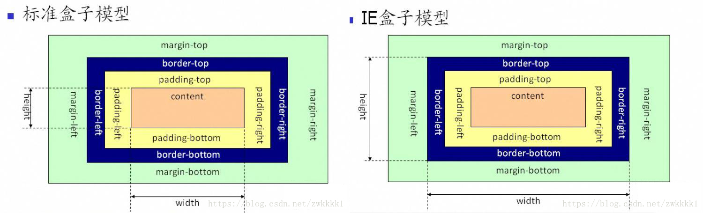

## HTML5概述.新特性

​	HTML5 w3c规范在2008年提出

**HTML5理念**

​	1.避免不必要的复杂

​	2.支持已有的写法

​	3.解决实际问题

​	4.优雅降级  （当浏览器不支持新的写法时会优雅降级到默认的值上）

​	5.用户优先  （用户>开发者>浏览器开发厂商>标准制定者>理论上的完美 )

**Doctype**

​	指web浏览器关于页面使用哪个HTML版本进行编写指令。

​	html5简化如下：<!DOCTYPE html>；

**标准模式，怪异模式**

​	验证：

​		在js中打印（“document.comapatMode“）

​		BackCompat->表示怪异模式

​		Css1Compat ->表示标准模式

​	区别：

​		1.标准盒模型和ie6混杂盒模型：标准下盒子宽度=width+padding+border;  ie6之前才会触发ie6混合

​		2.table字体在标准模式下继承body，怪异模式下不继承body

​		3.ie6以下版本中可以给span等行元素设置宽高

​		4.即使父级没有高度，也可以设置百分比高度

​		5.ie6以下 margin：0 auto 不能左右居中

​		6.ie6以下的图片padding失效

ie6混杂模式盒模型 把padding border都缩在width里面了，导致content区域变小 

**HTML5新特性** 

​	1.主要的新特性

​	2.新语义元素

​	3.forms 2表单元素 HTML网页表单的改进，其中为 input 标签引入了新属性。

​	4.音视频

​	5.画布

​	6.拖放

​	7.文件读取

​	8.回调函数管理api

​	9.地理位置

​	10.执行脚本多线程worker

​	11.本地储存

​	12.websocket

​	13.HistoryAPI

​	14.跨文档通信postmessage

