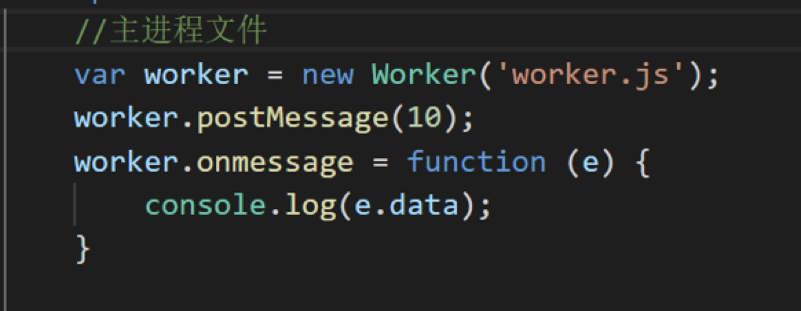
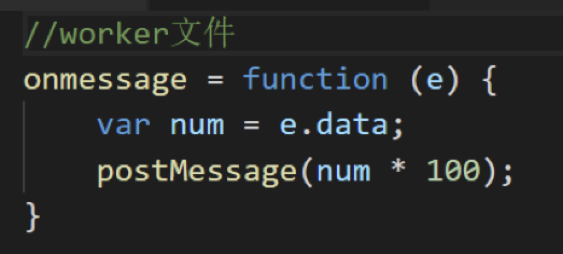

## Worker多线程处理

**使用场景**

大型数据运算、计时器、异步请求、访问navigator部分属性、js核心对象

**使用Worker**

**结束worker**

1、close() 在worker文件中使用

2、terminate() 在worker对象上调用（worker.terminate）

**局限性**

1、不能跨域加载（所以我放到了服务器下）

2、worker文件不能访问DOM

