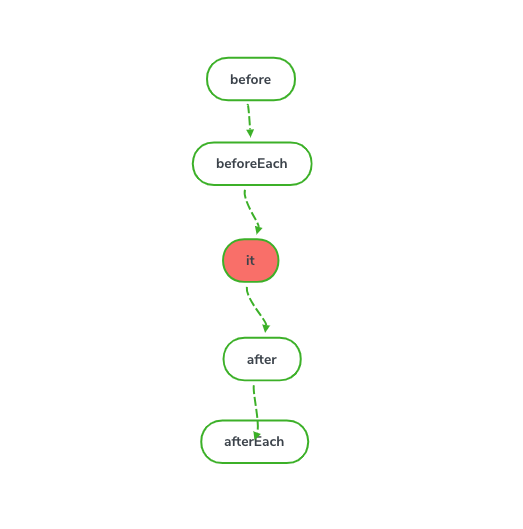

## JavaScript 与 QA 工程师

### 测试的核心概念

- 正确性:测试可以验证代码的正确性，在上线前做到心里有底
- 自动化:当然手工也可以测试，通过console可以打印出内部信息，但是这是一次 性的事情，下次测试还需要从头来过，效率不能得到保证。通过编写测试用例，可 以做到一次编写，多次运行 
- 解释性:测试用例用于测试接口、模块的重要性，那么在测试用例中就会涉及如何 使用这些API。其他开发人员如果要使用这些API，那阅读测试用例是一种很好地途 径，有时比文档说明更清晰 
- 驱动开发，指导设计:代码被测试的前提是代码本身的可测试性，那么要保证代码 的可测试性，就需要在开发中注意API的设计，TDD将测试前移就是起到这么一个 作用 
- 保证重构:互联网行业产品迭代速度很快，迭代后必然存在代码重构的过程，那怎么才能保证重构后代码的质量呢?有测试用例做后盾，就可以大胆的进行重构

### 单元测试

- 目的:单元测试能够让开发者明确知道代码结果

- 原则:单一职责、接口抽象、层次分离
- 断言库:保证最小单元是否正常运行检测方法
- 测试风格:测试驱动开发(Test-Driven Development,TDD)、(Behavior Driven Development,BDD)行为驱动开发均是敏捷开发方法论。
 TDD关注所有的功能是否被实现(每一个功能都必须有对应的测试用 例)，suite配合test利用assert('tobi' == user.name);
 BDD关注整体行为是否符合整体预期,编写的每一行代码都有目的提 供一个全面的测试用例集。expect/should,describe配合it利用自然语 言expect(1).toEqual(fn())执行结果。 
- 单元测试框架：

  - [better-assert](https://github.com/tj/better-assert)（TDD断言库）
  - [should.js](https://github.com/tj/should.js)（BDD断言库）
  -  [Expect.js](https://github.com/Automattic/expect.js)（BDD断言库）
  -  [Chai.js](https://github.com/producthunt/chai-enzyme)（TDD BDD双模）
  - Jasmine.js（BDD）
  - karma 自动化runner集成PhantomJS无刷新 （无界面浏览器）

##### 流程




每一个测试用例通过describe进行设置

1. before单个测试用例(it)开始
2. beforeEach每一个测试用例开始前
3. it定义测试用例 并利用断言库进行

设置chai如： expect(x).to.equal(true)

异步mocha

以上专业术语叫mock


### 使用[karma](http://karma-runner.github.io/latest/index.html)进行测试

1. 通过`npm init -y` 初始化安装 `package.json`

2. 针对` index.js` 创建`index.spec.js`测试用例文件

3. 

4. ```javascript
   index.js
   
   function add(num){
       if(num == 1){
           return 1
       }else{
           return num + 1;
       }
   }
   
   ```

   ```javascript
   index.spec.js
   
   describe("unit test", function(){
       it("test add function", function(){
           expect(add(1)).toBe(1);
           expect(add(2)).toBe(3);
       })
   })
   ```

5. 通过`npm install karma --save-dev`安装 karma

6. 通过`npm install -g karma-cli`安装 karma-cli

7.  通过`karma init` 初始化karma, 然后选择 `Jasmine` 断言库, 不使用`Require.js`, 选择`PhantomJS`(无头浏览器)，完成后会在根目录下生成[karma.conf.js](./karma.conf.js)文件

8. 配置代码覆盖率: 使用 [karma-coverage](https://www.npmjs.com/package/karma-coverage) 通过`npm i karma-coverage --save-dev`安装

9. 通过 `karma start` 运行


### 对接口进行测试

1. 使用[koa](https://koa.bootcss.com/)服务 

   ```javascript
   index.js
   
   const Koa = require('koa');
   const app = new Koa();
   
   app.use(async ctx => {
     ctx.body = {
         data: 'hello', //返回的数据
     }
   })
   
   app.listen(3000);
   
   module.export = app;
   ```

2. 使用[supertest](https://www.npmjs.com/package/supertest) 测试接口

   ```javascript
   index.spec.js
   
   const app = require('./index');
   const request = require('supertest');
   
   function req(){
       return request(app.listen())
   }
   
   describe('Node server test', function(){
       it('获取服务数据', function(done){
           request()
           .get('/')
           .set('Accept','application/json')
           .expect('Content-type',/json/)
           .expect(200)
           .end(function(err, res){
               if(res.body.data == 'hello'){
                   done();
               }else{
                   done(new Error(err));
               }
           })
       })
   })
   ```

3. 使用[mocha](https://mochajs.org/)框架 ，使用[mochawesome](https://www.npmjs.com/package/mochawesome)生成报表

   ```javascript
   mocha.js
   
   const Mocha = require('mocha');
   const mocha = new Mocha({
       reporter: 'mochawesome', //使用报表
       reporterOptions:{
           reportDir: './docs/mochawesome', //报表生成的路径
       }
   });
   
   mocha.addFile('./service/index.spec.js')
   mocha.run(function(err){
       if(err){
           process.exit(1);
       }else{
           console.log('all down')
           process.exit(0);        
       }
   })
   ```

4. 运行上面的`mocha.js`即可


### e2e 端对端

npm安装[selenium-webdriver](https://www.npmjs.com/package/selenium-webdriver)；并且要安装针对于不同浏览器的插件才能打开浏览器，安装后将压缩包解压到测试文件的根目录，

f2etest: https://github.com/alibaba/f2etest, 进行浏览器兼容性测试

Macaca：https://github.com/alibaba/macaca

[uirecorder](https://uirecorder.com/) 一端录制，多端使用的便捷 UI 自动化测试工具。


[Rize](https://rize.js.org/zh-CN/) : 进行 UI 测试或 E2E 测试

```javascript
const Rize = require('rize');
const rize = new Rize();

rize
  .goto('https://github.com/')
  .type('input.header-search-input', 'node')
  .press('Enter')
  .waitForNavigation()
  .assertSee('Node.js')
  .end()  // 别忘了调用 `end` 方法来退出浏览器！
```


### UI测试

[phantomcss](https://www.npmjs.com/package/phantomcss) 

[backstopjs](https://www.npmjs.com/package/backstopjs) 

​	参考链接： https://www.cnblogs.com/xumqfaith/p/8108784.html

1. 通过`backstop init` 初始化; 然后会在当前文件夹下生成`backstop.json`; 在这里配置一些参数

```json
"viewports": [ //配置屏幕尺寸
    {
      "label": "phone",
      "width": 375,
      "height": 667
    },
    {
      "label": "tablet",
      "width": 1024,
      "height": 768
    }
  ],

"scenarios": [
    {
      "label": "map",
      "cookiePath": "backstop_data/engine_scripts/cookies.json",//cookie
      "url": "https://www.google.com/", //项目地址
    }
  ],


"paths": {
    "bitmaps_reference": "backstop_data/bitmaps_reference", //UI的效果图 参考的图片
    "bitmaps_test": "backstop_data/bitmaps_test",
    "engine_scripts": "backstop_data/engine_scripts",
    "html_report": "./docs/sbackstop_data/html_report", //报表输出的文件夹
    "ci_report": "backstop_data/ci_report"
  }


```


2. 最后通过 `backstop test` 运行


#### 性能测试

##### 基准测试

面向切面编程AOP无侵入式统计

Benchmark基准方法，它并不是简单的统计执行多少次测试代码后对比时间，它测试有着严密的抽样过程。执行多少次取决于采样到的数据能否完成统计。根据统计次数计算方差。

##### 压力测试

对网络接口做压力测试需要检查的几个常用指标有 吞吐量 响应时间 和 并发数，这些指标反映了服务器的并发处理能力

pv网站当日的访问人数 UV独立访问人数。PV每天几十万甚至几百万以上需要考虑压力测试。

 换算公式QPS = PV/t  ps:1000000 / 10 * 60 * 60 = 27.2 (100万请求集中在10小时，服务器每秒处理27.2个业务请求)

常用的压力测试工具 ab, siege, heep_load


#### 安全测试

XSS

SQL

CSRF

#### 功能测试

用户真实性检查


selenium-webdriver

protractor selenium-standalone

http://webdriver.io webdriver I/O


- 冒烟测试 smoke test 自由测试的一种，找到一个bug开发修复，然后针对此bug；优点节省时间防止build失败，缺点 覆盖率极地
- 回归测试  修改一处对整体功能进行全部测试，一般配合自动化测试


## 相关链接

https://www.jianshu.com/p/c7bde9c34e5b

