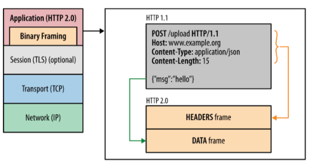

## HTTP2 & 3

- [HTTP2协议分析](#HTTP2协议分析)
- [HTTP2二进制分帧层](#HTTP2二进制分帧层)
- [HTTP2多路复用](#HTTP2多路复用)
- [HTTP2服务器推送](#HTTP2服务器推送)
- [HTTP2的伪头字段](#HTTP2的伪头字段)
- [了解HTTP3](#了解HTTP3)
- [队首阻塞问题](#队首阻塞问题)

### HTTP2协议分析

- HTTP/2 没有改动 HTTP 的应用语义。 HTTP 方法、状态代码、URI 和标 头字段等核心概念一如往常。
- HTTP/2 修改了数据格式化(分帧)以及在客户端与服务器间传输的方 式。这两点统帅全局，通过新的分帧层向我们的应用隐藏了所有复杂性。
- 由于HTTP/2 引入了一个新的二进制分帧层，该层无法与之前的 HTTP/ 1.x 服务器和客户端向后兼容，因此协议的主版本提升到 HTTP/2。
- HTTP2的特点: 
  - 使用二进制格式传输，更高效、更紧凑。 
  - 对报头压缩，降低开销。
  -  多路复用，一个网络连接实现并行请求。
  -  服务器主动推送，减少请求的延迟 
  - 默认使用加密

### HTTP2二进制分帧层

- HTTP/2 所有性能增强的核心在于新的二进制分帧 层，它定义了如何封装 HTTP 消息并在客户端与服 务器之间传输。 
- 这里所谓的“层”指的是位于套接字接口与应用可见 的高级 HTTP API 之间一个经过优化的新编码机 制。 
- HTTP/1.x 协议以换行符作为纯文本的分隔符，而 HTTP/2 将所有传输的信息分割为更小的消息和 帧，并采用二进制格式对它们编码。 
- 客户端和服务器会替我们完成必要的分帧工作。

### HTTP2多路复用

- 在 HTTP/1.x 中，如果客户端要想发起多个并行请求以提升性能，则必须使 用多个 TCP 连接。这种模型也会导致队首阻塞，从而造成底层 TCP 连接的 效率低下。
- 将 HTTP 消息分解为独立的帧，交错发送，然后在另一端重新组装是 HTTP 2 最重要的一项增强。这个机制会在整个网络技术栈中引发一系列连锁反 应，从而带来巨大的性能提升。
  - 并行交错地发送多个请求，请求之间互不影响。 
  - 并行交错地发送多个响应，响应之间互不干扰。 
  - 使用一个连接并行发送多个请求和响应。 
  - 不必再为绕过 HTTP/1.x 限制而做很多工作
  - 消除不必要的延迟和提高现有网络容量的利用率，从而减少页面加载时间。

#### HTTP2服务器推送

- HTTP/2 新增的另一个强大的新功能是，服务器可以对一个客户端请求发送多个响 应。 换句话说，除了对最初请求的响应外，服务器还可以向客户端推送额外资源， 而无需客户端明确地请求。
- HTTP/2 打破了严格的请求-响应语义，支持一对多和服务器发起的推送工作流 
- 服务器已经知道客户端下一步要请求什么资源，这时候服务器推送即可派上用场。
- 推送资源可以进行以下处理:
  - 由客户端缓存
  - 在不同页面之间重用
  - 与其他资源一起复用
  - 由服务器设定优先级
  - 被客户端拒绝

### HTTP2的伪头字段 

##### 伪头部字段是http2内置的几个特殊的以”:”开始的 key，用于替代HTTP/1.x中请求行/响应行中的信 息，比如请求方法，响应状态码等

- :method 请求方法
- :scheme 目标URL模式部分(请求) 
- :authority 目标RUL认证部分(请求)
- :path 目标URL的路径和查询部分(绝对路径 产生式和一个跟着"?"字符的查询产生式)。 (请求)
- :status 响应头中的HTTP状态码部分(响应)

### 了解HTTP3

- 运行在 QUIC 之上的 HTTP 协议被称为 HTTP/3(HTTP-over-QUIC)
- QUIC 协议(Quick UDP Internet Connection)基于 UDP，正是看中了 UDP 的速度与效率。同时 QUIC 也整合了 TCP、TLS 和 HTTP/2 的优 点，并加以优化。

##### 特点:

- 减少了握手的延迟(1-RTT 或 0-RTT)
- 多路复用，并且没有 TCP 的阻塞问题
- 连接迁移，(主要是在客户端)当由 Wifi 转移到 4G 时，连接不 会被断开。

HTTP 3与HTTP 1.1和HTTP 2没有直接的关系，也不是http2的扩展 

HTTP 3将会是一个全新的WEB协议

HTTP 3目前处于制订和测试阶段

https://www.chromium.org/quic

### 队首阻塞问题

- HTTP/1.1 和 HTTP/2 都存在队头阻塞问题(Head of line blocking)
- HTTP/1.1 的队头阻塞。一个 TCP 连接同时传输 10 个请求，其中第 1、2、3 个请求已被客户端接收，但第 4 个请求丢失，那么后面第 5 - 10 个请求都被阻塞，需要等第 4 个请求处理完毕才能被处理，这样 就浪费了带宽资源。
- HTTP/2 的多路复用虽然可以解决“请求”这个粒度的阻塞，但 HTTP/2 的基础 TCP 协议本身却也存在着队头阻塞的问题，假如某个数据包的 一个数据帧丢失了 整个数据包需要重传；
- 由于 HTTP/2 必须使用 HTTPS，而 HTTPS 使用的 TLS 协议也存在队 头阻塞问题。
- 队头阻塞会导致 HTTP/2 在更容易丢包的弱网络环境下比 HTTP/1.1 更慢
- 那 QUIC 解决队头阻塞问题的的方法:
  - QUIC 的传输单元是 Packet，加密单元也是 Packet，整个加密、 传输、解密都基于 Packet，这样就能避免 TLS 的队头阻塞问题;
  - QUIC 基于 UDP，UDP 的数据包在接收端没有处理顺序，即使中间 丢失一个包，也不会阻塞整条连接，其他的资源会被正常处理。

