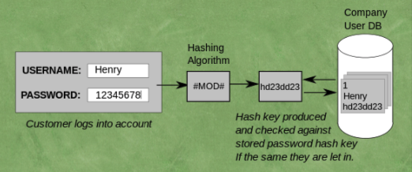
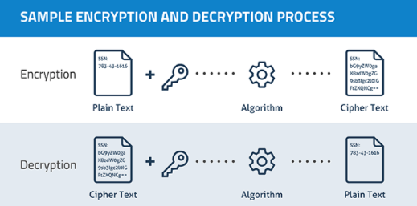
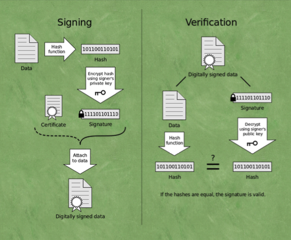
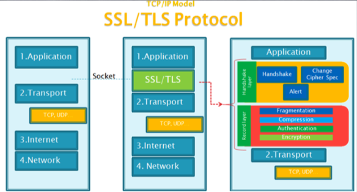
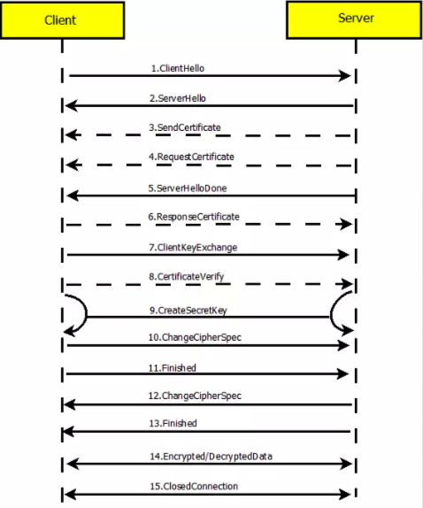

## HTTPS协议分析

- [密码学](#密码学)
- [SSL/TLS协议](#SSL/TLS协议)
- [HTTPS协议分析](#HTTPS协议分析)
- [HTTP2](#HTTP2)

### 密码学

- 密码学的处理对象是数字和字符串。 

- 散列是一种数据一旦转换为其他形式将永远无法恢复的加密技术。

- 加密
  - 对称加密(AES、DES、3DES) ：同一套加密算法可以进行加密解密，解密时进行反向运算
  - 非对称加密(RSA) ：会生成 `公钥` 与 `私钥` , 公钥用来加密吗私钥用来解密

##### 密钥交换算法

Diffie-Hellman算法是一种著名的密钥协商算法，这种算法可以使得信息交换的双方通过公开的非安 全的网络协商生成安全的共享密钥。

1. Alice与Bob确定两个大素数n和g，这两个数不用保密 
2. Alice选择另一个大随机数x，并计算A如下:A=gx mod n 
3. Alice将A发给Bob 
4. Bob选择另一个大随机数y，并计算B如下:B=gy mod n 
5. Bob将B发给Alice
6. 计算秘密密钥K1如下:K1=Bx mod n 
7. 计算秘密密钥K2如下:K2=Ay mod n K1=K2，

因此Alice和Bob可以用其进行加解密

#### 证书签发机构（CA）

通过CA发放的证书完成密钥的交换，实际上是利用非对称的加密算法完成数据加密密钥 的安全交换，然后再利用数据加密密钥完成数据的安全交换。

数字证书:数字证书是互联网通信中标识双方身份信息的数字文件，由CA签发。

CA:CA(certification authority)是数字证书的签发机构。作为权威机构，其审核申请 者身份后签发数字证书，这样我们只需要校验数字证书即可确定对方的真实身份。

##### CA的工作流程

1. 服务器 example.com将从CA请求TLS证书，例如 Digicert。

2. Digicert将为example.com创建证书，证书将包含必要的数据，例如服务器名称， 服务器的公钥等。

3. Digicert将创建数据(证书)的哈希值，并使用自己的私钥对其进行加密。 4.浏览器和操作系统自带Digicert等权威机构的公钥。

5. 当浏览器收到签名证书时，它将使用公钥从签名生成哈希值，它还将使用证书中 指定的散列算法生成数据(证书)的散列，如果两个哈希值匹配，则签名验证成 功并且证书是可信的。

6. 现在浏览器可以使用证书中指定的example.com的公钥继续进行身份验证过程。

 在这里，我们可以将Digicert称为 Root CA.

#### 浏览器如何验证服务器证书的有效性

证书颁发机构是为服务器创建并签署证书，很少有组织从事这项工 作，即Digicert，Geotrust，Comodo等。如果他们正在为所有服务器 签署证书，则必须为所有签名使用相同的私钥，如果它被盗，那么所 有的信任都会丢失。为了解决这个问题并增加更多的平均信息量，引 入了中间CA(intermediate CA)的概念。

服务器使用中级证书颁发机构的签名，因此，在与浏览器通信时，服务器将共享两个证书:

1. 包含服务器的公钥，即实际的服务器证书;

2. 由 Root CA 颁发的 intermediate CA 证书。

在签名验证期间，浏览器首先使用已经存储在浏览器中的Root CA的 公钥来验证中间证书的数字签名，如果成功，浏览器现在可以信任中 间证书及其公钥。现在使用此公钥，浏览器将验证原始服务器证书的 签名，该组织可以注册为intermediate CA，以便为其域签署证书。

### SSL/TLS协议

传输层安全性协议(Transport Layer Security - TLS)，及其前身安全套接层(Secure Sockets Layer - SSL)是一种安全协议，目的是为互联网通信提供安全及数据完整性保障

##### HTTPS协议的安全性由SSL协议实现，当前使用的TLS协议 1.2 版本包含了四个核心子协 议:握手协议、密钥配置切换协议、应用数据协议及报警协议。

- TLS适用于对称密钥 
- 对称密钥可以通过安全密钥交换算法共享 
- 如果请求被截获，密钥交换可能会被欺骗 
- 使用数字签名进行身份验证 
- 证书颁发机构和信任链。

##### HTTPS协议、SSL协议、TLS协议、握手协议的关系

- HTTPS是Hypertext Transfer Protocol over Secure Socket Layer的缩写，即HTTP over SSL，可理解为基于SSL的HTTP协议。HTTPS协议安全是由SSL协议实现的。

- SSL协议是一种记录协议，扩展性良好，可以很方便的添加子协议 
- 握手协议是SSL协议的一个子协议。 
- TLS协议是SSL协议的后续版本，本文中涉及的SSL协议默认是TLS协议1.2版本。

### HTTPS协议分析

##### TLS 握手的步骤:

1. ClientHello:客户端发送所支持的 SSL/TLS 最高协议版本号和所支持的加密算法集合及压缩方法集合等信息给 服务器端。

2. ServerHello:服务器端收到客户端信息后，选定双方都能够支持的 SSL/TLS 协议版本和加密方法及压缩方法， 返回给客户端。

3. SendCertificate(可选):服务器端发送服务端证书给客户端。

4. RequestCertificate(可选):如果选择双向验证，服务器端向客户端请求客户端证书。

5. ServerHelloDone:服务器端通知客户端初始协商结束。

6. ResponseCertificate(可选):如果选择双向验证，客户端向服务器端发送客户端证书。

7. ClientKeyExchange:客户端使用服务器端的公钥，对客户端公钥和密钥种子进行加密，再发送给服务器端。

8. CertificateVerify(可选):如果选择双向验证，客户端用本地私钥生成数字签名，并发送给服务器端，让其通 过收到的客户端公钥进行身份验证。

9. CreateSecretKey:通讯双方基于密钥种子等信息生成通讯密钥。
10. ChangeCipherSpec:客户端通知服务器端已将通讯方式切换到加密模式。
11. Finished:客户端做好加密通讯的准备。
12. ChangeCipherSpec:服务器端通知客户端已将通讯方式切换到加密模式。
13. Finished:服务器做好加密通讯的准备。
14. Encrypted/DecryptedData:双方使用客户端密钥，通过对称加密算法对通讯内容进行加密。 
15. ClosedConnection:通讯结束后，任何一方发出断开 SSL 连接的消息。

