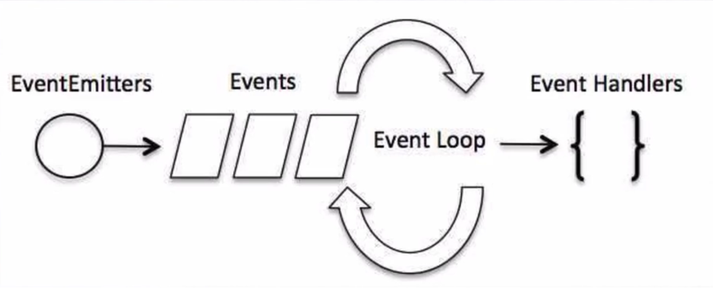

## 事件驱动机制

##### 事件驱动模型

 

绑定一个事件处理函数

```javascript
var events = require('events'); //引入event模块
var eventEmitter = new events.EventEmitter() //通过new来创建EventEmitter对象

//绑定事件处理函数
function connctHander(){
    console.log('connctHander被调用')
}

//通过eventEmitter对象下的on方法绑定，第一个参数：事件名称，第二个参数：事件处理函数的句柄
eventEmitter.on('connection',connctHander);//完成了事件绑定

//触发事件
eventEmitter.emit('connection');
console.log('程序施行完毕')

```

