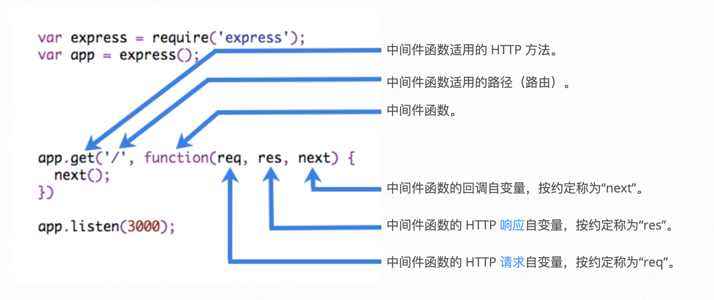

## Express中间件

Express 是一个路由和中间件 Web 框架，其自身只具有最低程度的功能：Express 应用程序基本上是一系列中间件函数调用。

*中间件*函数能够访问[请求对象](http://expressjs.com/zh-cn/4x/api.html#req) (`req`)、[响应对象](http://expressjs.com/zh-cn/4x/api.html#res) (`res`) 以及应用程序的请求/响应循环中的下一个中间件函数。下一个中间件函数通常由名为 `next` 的变量来表示。

中间件函数可以执行以下任务：

- 执行任何代码。
- 对请求和响应对象进行更改。
- 结束请求/响应循环。
- 调用堆栈中的下一个中间件。

如果当前中间件函数没有结束请求/响应循环，那么它必须调用 `next()`，以将控制权传递给下一个中间件函数。否则，请求将保持挂起状态。

##### Express 应用程序可以使用以下类型的中间件：

- [应用层中间件](http://expressjs.com/zh-cn/guide/using-middleware.html#middleware.application)
- [路由器层中间件](http://expressjs.com/zh-cn/guide/using-middleware.html#middleware.router)
- [错误处理中间件](http://expressjs.com/zh-cn/guide/using-middleware.html#middleware.error-handling)
- [内置中间件](http://expressjs.com/zh-cn/guide/using-middleware.html#middleware.built-in)
- [第三方中间件](http://expressjs.com/zh-cn/guide/using-middleware.html#middleware.third-party)

您可以使用可选安装路径来装入应用层和路由器层中间件。 还可以将一系列中间件函数一起装入，这样会在安装点创建中间件系统的子堆栈。

以下示例显示中间件函数调用的元素：

