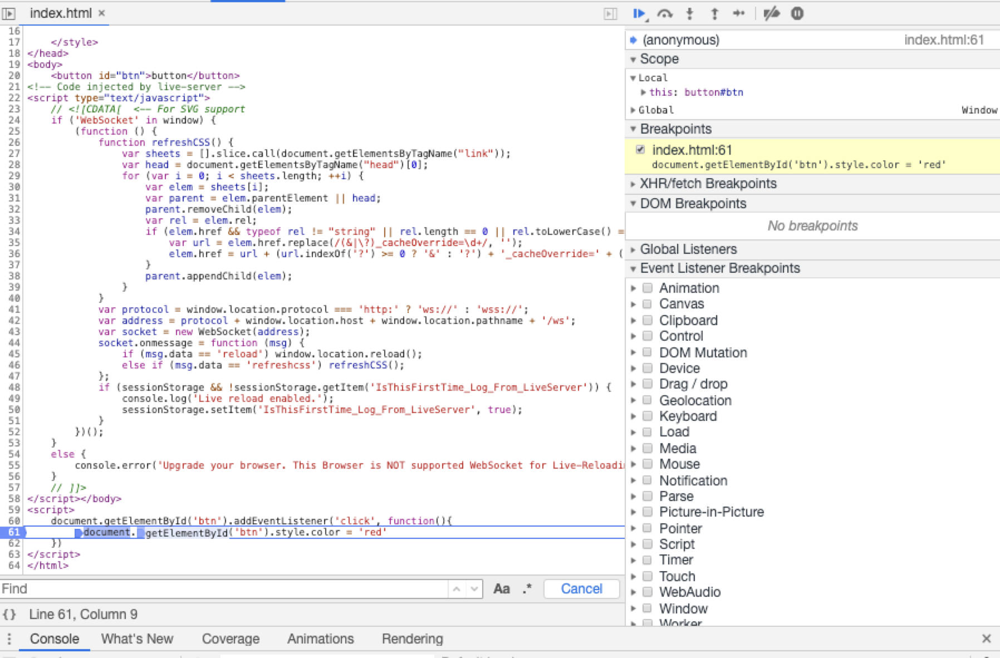
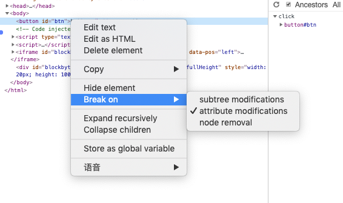
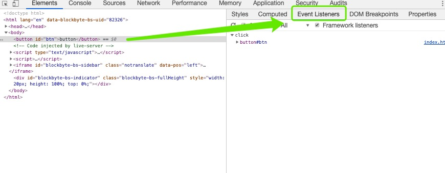
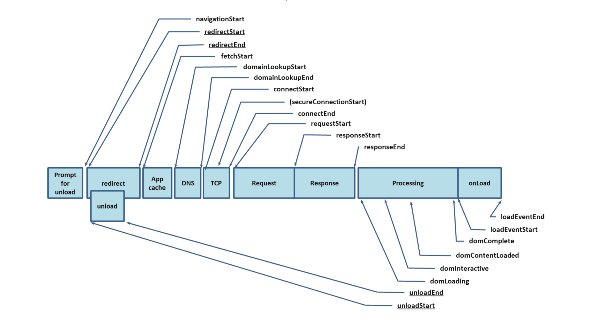
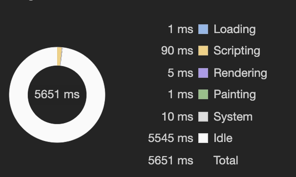

## 高级调试

#### 断点及捕捉事件绑定

##### JavaScript断点

> 控制台中点击sources `command + P`搜索文件




##### HTML断点

> 在Elements中右击某一个元素 => Break on
>
> 当当前元素子节点、属性或当前元素被remove的时候可以定位到js操作他的地方



##### 捕获事件绑定

> 点击一个元素，在右侧Event Listeners中可以看到当前DOM元素被绑定的事件



#### Audits和Chrome性能插件

控制台中Audits可以监测网站的性能

##### 网页显示出来经过的过程

浏览器提供了一组API`performance.timing`可以监测每个时间的时间，返回的是时间戳。



#### Timeline帧渲染

> 网页动画能做到每秒60帧，就会跟显示器同步刷新，1秒之内进行60次重新渲染，每次重新渲染的时间不能超过16.66毫秒



- 蓝色：网络通信和HTML解析
- 黄色：JavaScript执行
- 紫色：样式计算和布局，即重排
- 绿色：重绘

```javascript
window.requestAnimationFrame() //下一帧的时候执行
```


